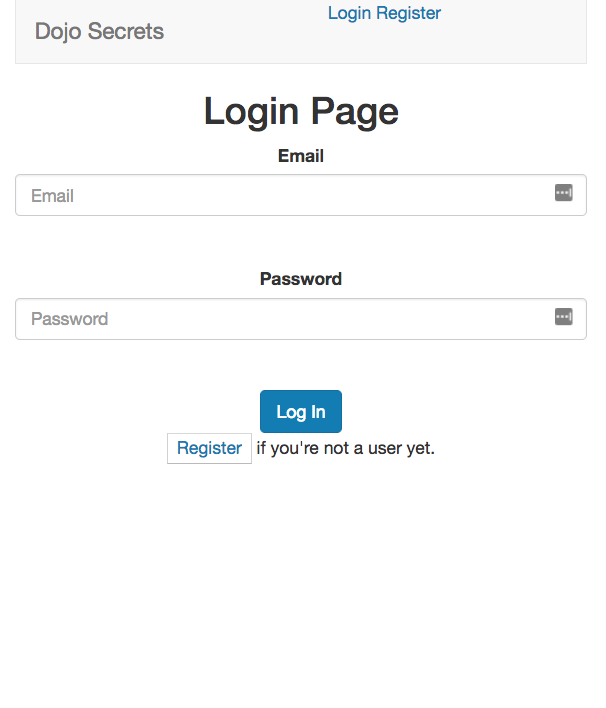
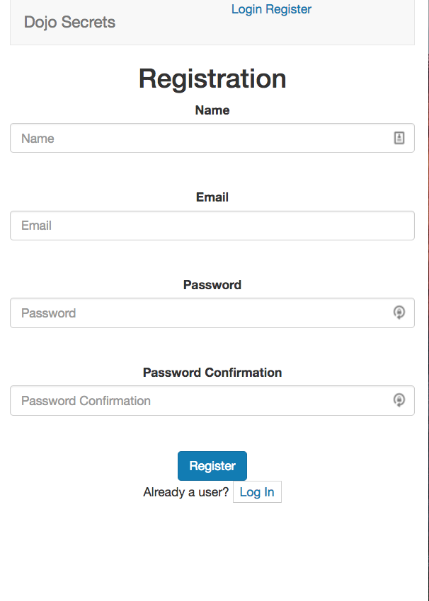
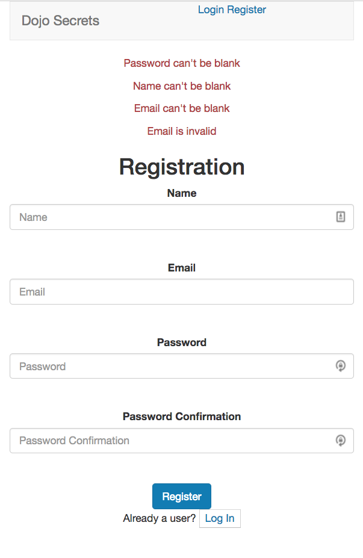
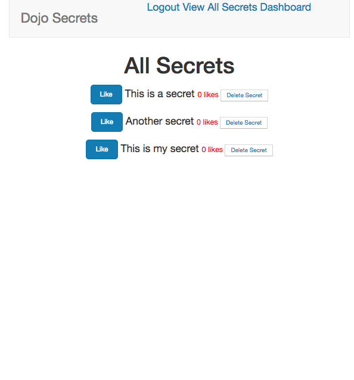
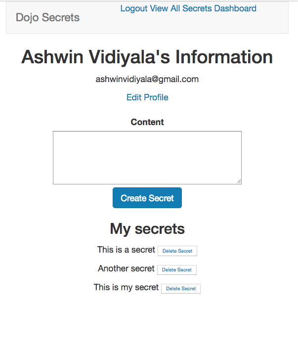

# Dojo Secrets

Rails app that lets users post anonymous "secrets" on a community wall. Built on Rails 4.

## Features

* Login and Registration validation.
* Content validation.
* Login Authorization.
* Logout
* There is authentication that restricts app functionality to only logged in users.
* Users can like each secret only once.
* Users can only delete their own secrets.
* Users can dislike secrets.
* Each secret is shown a count of the number of likes it has gotten.
* A user cannot delete another user's secret.
* A user can update only his own information.
* All data that is inputted has validations.

## Screenshots

### Login Page

### Registration Page

### Registration Page with Validation Errors

### All Secrets Page

### User Page

